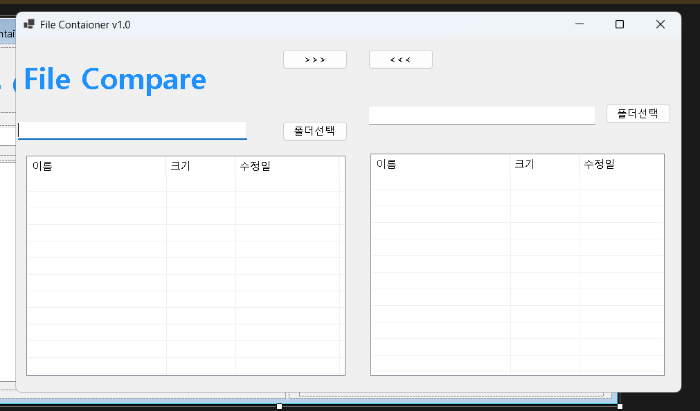
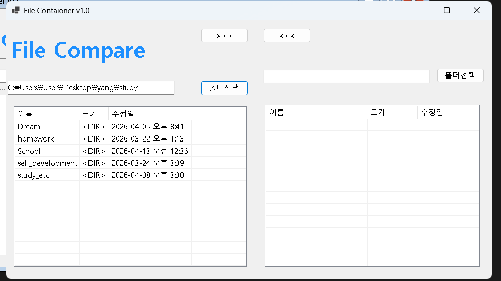
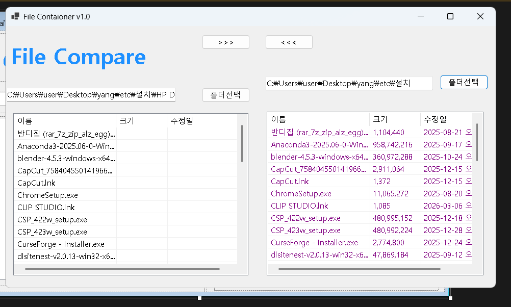
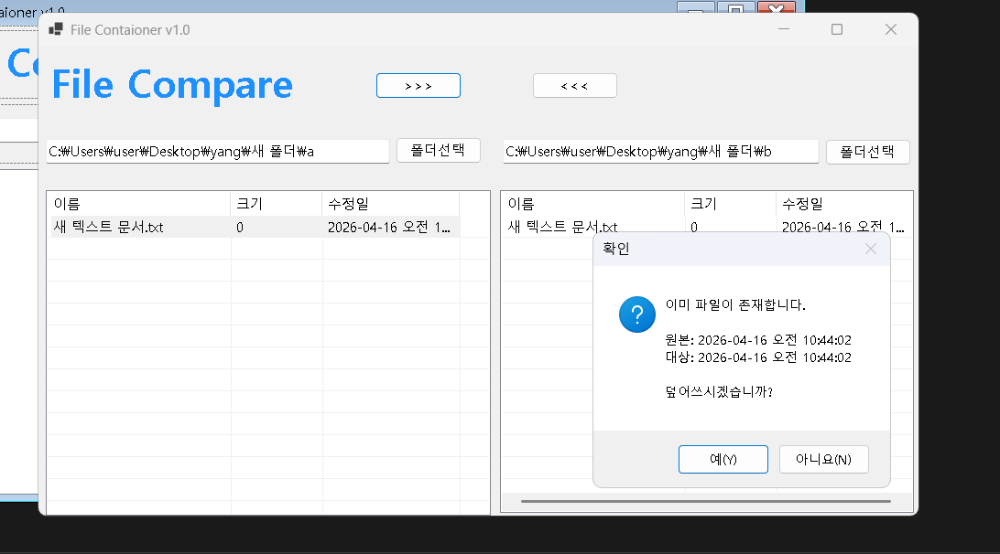
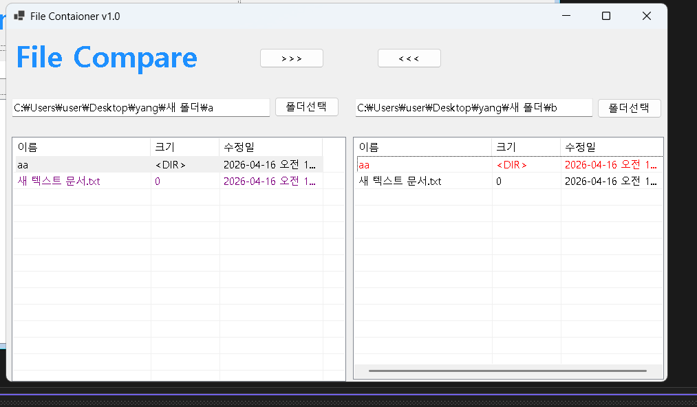

# FileCompare

# (C# 코딩) FileCompare

## 개요
- C# 프로그래밍 학습
- 1줄 소개: 두 폴더 간의 파일 및 폴더를 비교하고 색상으로 차이를 시각화하며, 상호 복사 및 동기화 기능을 제공하는 파일 관리 도구
- 사용한 플랫폼:
  - C#, .NET Windows Forms, Visual Studio, GitHub
- 사용한 컨트롤:
  - 입력: Button (폴더 선택, 복사 방향 버튼), TextBox (폴더 경로 표시)
  - 출력: ListView (파일 목록 표시 - 이름, 크기, 수정일), Label (상태 표시)
  - 컨테이너: SplitContainer (좌우 폴더 영역 구분), ImageList (아이콘 표시)
- 사용한 기술과 구현한 기능:
  - FolderBrowserDialog를 이용한 로컬 디렉토리 선택 기능
  - DirectoryInfo 및 FileInfo 클래스를 활용한 파일 시스템 탐색
  - ListView의 상세 보기(Details) 모드 및 컬럼 구성
  - 파일 수정 시간(LastWriteTime) 및 크기 비교 로직을 통한 데이터 무결성 확인
  - 색상 구분을 통한 파일 상태 시각화 (최신/구버전/미존재)
  - File.Copy 메서드를 이용한 파일 상호 복사 구현 및 덮어쓰기 처리
  - 재귀 호출을 이용한 하위 폴더 탐색 및 전체 복사 기능 구현 (과제4)
  - 사용자 입력 검증 및 예외 처리를 통한 프로그램 안정성 확보

## 실행 화면 (과제1)
- 과제1 코드의 실행 스크린샷 
   
  
  
- 과제 내용
  - SplitContainer를 활용하여 좌우 대칭형 기본 UI 구성
  - 파일 목록을 표시할 ListView 및 경로 표시용 TextBox, 버튼 배치
  - 사용자 친화적인 파일 탐색기 형태의 인터페이스 설계

- 구현 내용과 기능 설명
  - SplitContainer의 Orientation을 Vertical로 설정하여 화면을 2등분했다.
    사용한 코드: `splitContainer1.Orientation = Orientation.Vertical;`
  - ListView의 View 속성을 Details로 설정하고 컬럼을 추가하여 파일 정보를 구조적으로 출력했다.
    사용한 코드: `lvwLeftDir.View = View.Details; lvwLeftDir.Columns.Add("이름");`
  - 좌우 동일한 UI 구조를 적용하여 비교 기능을 고려한 인터페이스를 구성했다.

## 실행 화면 (과제2)
- 과제2 코드의 실행 스크린샷 
  
  
- 과제 내용
  - 폴더 선택 버튼 클릭 시 다이얼로그를 통해 경로 취득 및 표시
  - 선택된 폴더 내의 파일 및 폴더 리스트를 출력
  - 좌우 폴더 간 파일 비교 및 색상 표시 기능 구현

- 구현 내용과 기능 설명
  - FolderBrowserDialog를 사용하여 사용자로부터 경로를 입력받았다.
    사용한 코드: `if (dlg.ShowDialog() == DialogResult.OK) txtLeftDir.Text = dlg.SelectedPath;`
  - Directory.GetFiles() 및 GetDirectories()를 활용하여 파일과 폴더를 모두 탐색했다.
    사용한 코드: `Directory.GetFiles(path), Directory.GetDirectories(path)`
  - FileInfo를 활용하여 파일의 수정 시간을 비교하고 색상으로 표시했다.
    사용한 코드: `if (lf.LastWriteTime > rf.LastWriteTime) item.ForeColor = Color.Red;`
  - 색상 구분을 통해 사용자에게 직관적인 비교 결과를 제공하도록 구현했다.

## 실행 화면 (과제3)
- 과제3 코드의 실행 스크린샷 
  
  
- 과제 내용
  - 단일 파일 또는 다중 선택된 파일을 대상 폴더로 복사
  - 파일 복사 시 동일 파일 존재 여부 확인 및 덮어쓰기 로직 구현
  - 사용자에게 파일 상태 정보를 제공하여 안전한 복사 수행

- 구현 내용과 기능 설명
  - ListView의 MultiSelect 기능을 활용하여 다중 파일 선택을 지원했다.
    사용한 코드: `lvwLeftDir.MultiSelect = true;`
  - Path.Combine을 이용하여 안전한 파일 경로를 생성했다.
    사용한 코드: `string dest = Path.Combine(targetPath, fileName);`
  - File.Exists()로 대상 파일 존재 여부를 검사했다.
    사용한 코드: `if (File.Exists(dest))`
  - FileInfo를 활용하여 수정 시간을 비교하고 사용자에게 정보를 제공했다.
    사용한 코드: `new FileInfo(src).LastWriteTime`
  - MessageBox를 통해 덮어쓰기 여부를 사용자에게 확인받았다.
    사용한 코드: `MessageBox.Show("덮어쓰시겠습니까?", ...)`
  - 복사 후 ListView를 다시 로드하여 변경된 상태를 즉시 반영했다.

## 실행 화면 (과제4)
- 과제4 코드의 실행 스크린샷 
  
  
- 과제 내용
  - 현재 폴더뿐만 아니라 모든 하위 폴더의 파일까지 비교 및 복사 대상에 포함
  - 폴더 단위 복사 및 전체 동기화 기능 구현
  - 사용자 편의성을 고려한 덮어쓰기 처리 방식 개선

- 구현 내용과 기능 설명
  - 재귀 함수(Recursive Function)를 작성하여 하위 디렉토리까지 탐색하도록 구현했다.
    사용한 코드: `CopyRecursive(src, dest);`
  - Directory.Exists()를 통해 대상 폴더 존재 여부를 확인했다.
    사용한 코드: `if (Directory.Exists(dest))`
  - Directory.CreateDirectory()로 필요한 폴더를 자동 생성했다.
    사용한 코드: `Directory.CreateDirectory(dest);`
  - 폴더 복사 시 덮어쓰기 여부를 1회만 확인하도록 구현했다.
    → 반복적인 확인을 방지하여 사용자 경험을 개선
  - 전체 덮어쓰기 선택 시 내부 파일에 대한 추가 확인을 생략하도록 설계했다.
    사용한 코드: `CopyRecursive(src, dest, true);`
  - 파일 복사는 기존 과제3의 시간 비교 및 덮어쓰기 로직을 유지하여 일관성을 확보했다.